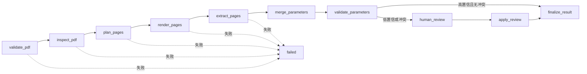

# PDF 信息提取助手

该 Agent 不把整本 PDF 直接交给模型。它先逐页渲染，再让视觉模型按固定 Schema 提取原始标注、数值、单位、公差、页码证据和置信度，最后用确定性规则合并与校验。

## Graph



## Nodes

| Node | 作用 | 主要输出 |
|---|---|---|
| `validate_pdf` | 校验路径、扩展名和 `%PDF-` 文件签名 | `status`, `errors` |
| `inspect_pdf` | 获取页数、元数据和可用文本层；优先 PyMuPDF，回退 Poppler | `pdf_metadata`, `page_texts` |
| `plan_pages` | 处理指定页；长文档按机械图关键词选出最相关页面，默认最多 20 页 | `selected_pages` |
| `render_pages` | 以 150-400 DPI 把每页渲染为 PNG，避免整本 PDF 读取限制 | `page_images` |
| `extract_pages` | Qwen VL 逐页并发提取参数、原始标注、单位、公差、证据和置信度 | `page_extractions` |
| `merge_parameters` | 规范 canonical key，跨页去重，保留全部来源并标记冲突 | `merged_parameters` |
| `validate_parameters` | 检查关键字段、跨页冲突、针距跨度和针长尺寸链 | `validation_issues`, `needs_human_review` |
| `human_review` | 仅在低置信或硬冲突时用 LangGraph `interrupt()` 暂停 | `review_decision` |
| `apply_review` | 应用人工修正后重新执行一致性校验 | 修正后的参数与问题列表 |
| `finalize_result` | 输出 JSON、扁平参数表和可读 Markdown，并清理临时页图 | `result` |
| `failed` | 收敛文件、依赖、渲染或全页提取失败 | 统一失败结果 |

## 调用

```python
from backend.agents.pdf.graph import build_pdf_extraction_graph

graph = build_pdf_extraction_graph()
result = await graph.ainvoke(
    {
        "pdf_file_path": r"D:\drawing.pdf",
        "max_pages": 20,
        "render_dpi": 240,
        "keep_rendered_pages": False,
        "errors": [],
    },
    config={"configurable": {"thread_id": "pdf-job-001"}},
)
```

如果结果包含 `__interrupt__`，前端应展示参数证据和校验问题，再用 `Command(resume=...)` 恢复。

